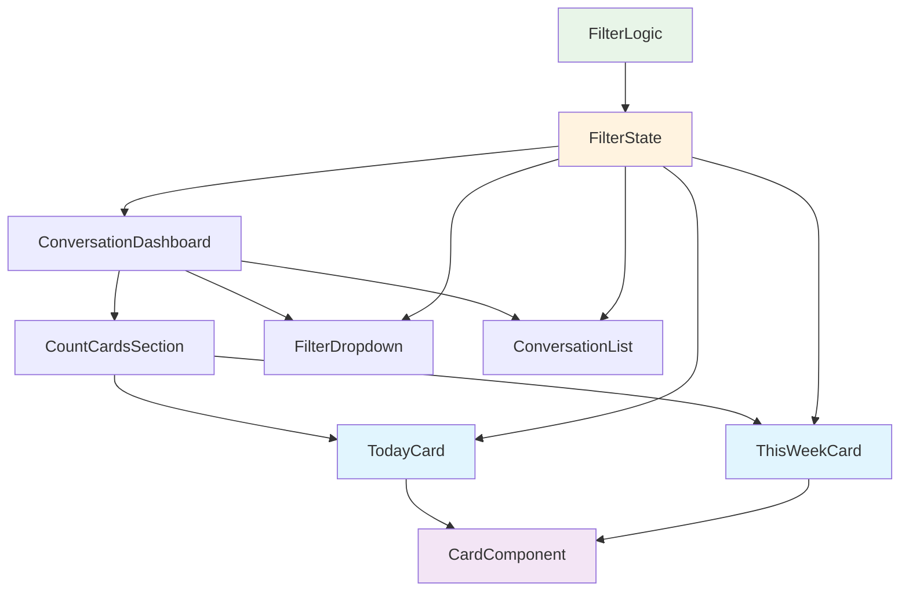

# Architecture Design Document: Clickable Count Cards Enhancement

## System Overview

The archpointlabs conversation dashboard requires enhancement to make "Today" and "This Week" count cards interactive filters. This is a **frontend-only enhancement** to an existing Next.js application with TypeScript, maintaining all current functionality while adding clickable card interactions.

**Enhancement Scope:**
- Convert static count cards to interactive filter components
- Synchronize card state with existing dropdown filter
- Maintain existing filtering logic and data flow
- Add accessibility and responsive design considerations

## Technology Stack

**Existing Stack (Preserved):**
- **Frontend Framework:** Next.js with React
- **Language:** TypeScript
- **Styling:** Tailwind CSS
- **Build Tool:** Next.js built-in bundler

**Justification for Maintaining Current Stack:**
- **Next.js/React:** Already established, team familiar, component-based architecture ideal for this enhancement
- **TypeScript:** Provides type safety for state management and props
- **Tailwind CSS:** Existing utility-first approach perfect for hover states and interactive styling
- **No new dependencies required:** Enhancement leverages existing patterns

## Component Architecture



**Component Responsibilities:**
- **CountCardsSection:** Container for interactive cards with unified state management
- **TodayCard/ThisWeekCard:** Specialized card components with click handlers
- **CardComponent:** Reusable base component with hover/active states
- **FilterState:** Centralized state management for all time filters
- **FilterLogic:** Shared filtering logic between cards and dropdown

## Data Models

```typescript
// Enhanced filter state interface
interface TimeFilter {
  type: 'today' | 'thisWeek' | 'thisMonth' | 'all' | null;
  label: string;
  isActive: boolean;
}

interface CountCardData {
  id: string;
  title: string;
  count: number;
  filterType: 'today' | 'thisWeek';
  isClickable: boolean;
  isActive: boolean;
}

interface FilterState {
  activeTimeFilter: TimeFilter['type'];
  cardFilters: {
    today: boolean;
    thisWeek: boolean;
  };
  conversations: Conversation[];
  filteredConversations: Conversation[];
}
```

## API Design

**No new API endpoints required.** Enhancement reuses existing conversation filtering logic.

**State Management Interface:**
```typescript
interface FilterActions {
  setTimeFilter: (filter: TimeFilter['type']) => void;
  clearFilters: () => void;
  toggleCardFilter: (cardType: 'today' | 'thisWeek') => void;
}

interface FilterHooks {
  useFilterState: () => FilterState;
  useFilterActions: () => FilterActions;
  useConversationData: (filter: TimeFilter['type']) => Conversation[];
}
```

## Security Architecture

**No security changes required.** Enhancement operates within existing security boundaries:
- Client-side filtering only (no additional data exposure)
- No new authentication/authorization requirements
- Maintains existing data access patterns

## Deployment Architecture

**No deployment changes required.**
- Frontend-only enhancement
- Deploys with existing Vercel configuration
- No additional infrastructure needed
- Uses existing CI/CD pipeline (once established)

## Technical Decisions Log

### Decision 1: State Management Approach
**Decision:** Use React Context + useReducer for filter state management
**Reasoning:** 
- Existing codebase likely uses React patterns
- Avoids external state management complexity
- Natural fit for filter synchronization between components
**Alternatives Considered:** 
- Redux (overkill for this enhancement)
- Component state (insufficient for cross-component synchronization)

### Decision 2: Component Architecture Pattern
**Decision:** Enhance existing card components rather than replace them
**Reasoning:**
- Preserves existing styling and layout
- Minimizes risk of breaking current functionality
- Follows enhancement-not-rewrite principle
**Alternatives Considered:**
- Complete card component rewrite (too risky)
- Wrapper components (unnecessary complexity)

### Decision 3: Accessibility Implementation
**Decision:** Implement full keyboard navigation and screen reader support
**Reasoning:**
- Modern web standards requirement
- Likely existing pattern in codebase to follow
- User preference for pragmatic approach includes accessibility
**Alternatives Considered:**
- Basic implementation only (insufficient for production)

### Decision 4: Animation Strategy
**Decision:** Use Tailwind CSS transitions with existing design system
**Reasoning:**
- Consistent with existing styling approach
- No additional dependencies
- Performant CSS-based animations
**Alternatives Considered:**
- Framer Motion (unnecessary dependency for simple transitions)
- Custom CSS animations (inconsistent with Tailwind approach)

### Decision 5: TypeScript Integration
**Decision:** Fully typed implementation with strict interfaces
**Reasoning:**
- Existing codebase is TypeScript
- User has Python preference (values type safety)
- Prevents runtime errors in filter state management
**Alternatives Considered:**
- Minimal typing (reduces codebase consistency)

## Implementation Priority

**Phase 1: Core Functionality**
1. Enhance card components with click handlers
2. Implement filter state synchronization
3. Add basic hover states

**Phase 2: Polish & Accessibility**
1. Add keyboard navigation
2. Implement screen reader support
3. Add smooth transitions and animations

**Phase 3: Testing & Optimization**
1. Add comprehensive component tests
2. Performance optimization
3. Cross-browser validation

## Risk Mitigation

**Risk:** Breaking existing filter functionality
**Mitigation:** Preserve all existing filter logic, only add new interaction paths

**Risk:** State synchronization bugs between cards and dropdown
**Mitigation:** Centralized state management with clear action patterns

**Risk:** Accessibility compliance issues
**Mitigation:** Follow WCAG 2.1 AA guidelines, test with screen readers

---

This architecture maintains the existing Next.js/TypeScript/Tailwind stack while providing a clean, maintainable enhancement that respects the current codebase patterns. The component-based approach allows for incremental implementation and easy testing.

**Sophia**  
*Principal Software Architect, Claude Dev Team*