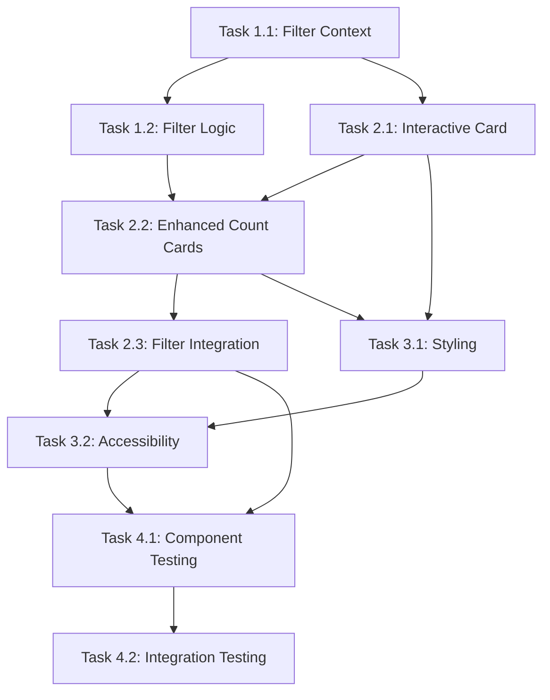

# Implementation Plan: Clickable Count Cards Enhancement

## Overview
This plan implements interactive count cards for the conversation dashboard, making "Today" and "This Week" cards clickable filters while maintaining existing functionality and architecture patterns.

## Task Breakdown

### Phase 1: Core State Management & Infrastructure

#### Task 1.1: Filter State Context Setup
**Complexity:** Medium (3-4 hours)
**Dependencies:** None
**Files:**
- `lib/contexts/FilterContext.tsx` (new)
- `lib/types/filter.ts` (new)
- `lib/hooks/useFilter.ts` (new)

**Description:** Create centralized state management for all time filters using React Context + useReducer pattern.

#### Task 1.2: Filter Logic Abstraction
**Complexity:** Medium (2-3 hours)
**Dependencies:** Task 1.1
**Files:**
- `lib/utils/filterUtils.ts` (new)
- `lib/utils/dateUtils.ts` (new)

**Description:** Extract and centralize existing filter logic for reuse between cards and dropdown.

### Phase 2: Component Enhancement

#### Task 2.1: Base Interactive Card Component
**Complexity:** Medium (3-4 hours)
**Dependencies:** Task 1.1
**Files:**
- `components/ui/InteractiveCard.tsx` (new)
- `components/ui/card.tsx` (modify existing)

**Description:** Create reusable base component for clickable cards with hover states, accessibility, and visual feedback.

#### Task 2.2: Enhanced Count Cards
**Complexity:** High (4-5 hours)
**Dependencies:** Task 2.1, Task 1.2
**Files:**
- `components/dashboard/CountCard.tsx` (modify existing)
- `components/dashboard/CountCardsSection.tsx` (modify existing)

**Description:** Enhance existing count cards to be interactive, with click handlers and active state management.

#### Task 2.3: Filter Integration
**Complexity:** High (4-5 hours)
**Dependencies:** Task 2.2, Task 1.2
**Files:**
- `components/dashboard/ConversationDashboard.tsx` (modify existing)
- `components/dashboard/FilterDropdown.tsx` (modify existing)

**Description:** Integrate card clicks with existing filter dropdown, ensuring state synchronization.

### Phase 3: User Experience & Accessibility

#### Task 3.1: Styling & Animations
**Complexity:** Medium (2-3 hours)
**Dependencies:** Task 2.2
**Files:**
- `styles/components/cards.css` (new, if needed)
- Update existing card styles with Tailwind classes

**Description:** Implement hover effects, active states, and smooth transitions using Tailwind CSS.

#### Task 3.2: Accessibility Implementation
**Complexity:** Medium (3-4 hours)
**Dependencies:** Task 2.1
**Files:**
- Update `components/ui/InteractiveCard.tsx`
- Update `components/dashboard/CountCard.tsx`

**Description:** Add keyboard navigation, ARIA labels, screen reader support, and focus management.

### Phase 4: Testing & Documentation

#### Task 4.1: Component Testing
**Complexity:** Medium (3-4 hours)
**Dependencies:** All previous tasks
**Files:**
- `__tests__/components/InteractiveCard.test.tsx` (new)
- `__tests__/components/CountCard.test.tsx` (new)
- `__tests__/contexts/FilterContext.test.tsx` (new)

**Description:** Create comprehensive tests for new components and state management.

#### Task 4.2: Integration Testing
**Complexity:** Medium (2-3 hours)
**Dependencies:** Task 4.1
**Files:**
- `__tests__/dashboard/ConversationDashboard.test.tsx` (new)

**Description:** Test complete filter interaction flow and state synchronization.

## File Structure

```
archpointlabs/
├── components/
│   ├── dashboard/
│   │   ├── ConversationDashboard.tsx         # Modified - integrate filter context
│   │   ├── CountCard.tsx                     # Modified - add click handlers
│   │   ├── CountCardsSection.tsx             # Modified - manage card state
│   │   └── FilterDropdown.tsx                # Modified - sync with cards
│   └── ui/
│       ├── InteractiveCard.tsx               # New - reusable clickable card
│       └── card.tsx                          # Modified - extend for interactions
├── lib/
│   ├── contexts/
│   │   └── FilterContext.tsx                 # New - centralized state
│   ├── hooks/
│   │   └── useFilter.ts                      # New - filter state hook
│   ├── types/
│   │   └── filter.ts                         # New - TypeScript interfaces
│   └── utils/
│       ├── filterUtils.ts                    # New - filter logic
│       └── dateUtils.ts                      # New - date calculations
├── __tests__/
│   ├── components/
│   │   ├── InteractiveCard.test.tsx          # New
│   │   └── CountCard.test.tsx                # New
│   ├── contexts/
│   │   └── FilterContext.test.tsx            # New
│   └── dashboard/
│       └── ConversationDashboard.test.tsx    # New
└── styles/
    └── components/
        └── cards.css                         # New (if needed)
```

## Reusable Components

### 1. InteractiveCard Component
```typescript
interface InteractiveCardProps {
  title: string;
  value: string | number;
  isActive?: boolean;
  isClickable?: boolean;
  onClick?: () => void;
  className?: string;
  ariaLabel?: string;
}
```

**Reusability:** Base for any clickable dashboard card, future metric cards, filter cards.

### 2. FilterContext Provider
```typescript
interface FilterContextValue {
  state: FilterState;
  actions: FilterActions;
}
```

**Reusability:** Can be extended for additional filter types, other dashboard pages, advanced filtering features.

### 3. Filter Utilities
```typescript
export const filterUtils = {
  getDateRange: (type: FilterType) => DateRange;
  filterConversations: (conversations: Conversation[], filter: FilterType) => Conversation[];
  isFilterActive: (current: FilterType, target: FilterType) => boolean;
}
```

**Reusability:** Shared across all filtering components, extensible for new filter types.

## Implementation Dependencies



## Risk Mitigation Strategy

### High Priority Risks
1. **Breaking Existing Filters**
   - **Mitigation:** Preserve all existing filter logic in separate utils
   - **Task:** 1.2 - Abstract without modifying existing behavior

2. **State Synchronization Issues**
   - **Mitigation:** Single source of truth via FilterContext
   - **Task:** 1.1 - Centralized state management

3. **Performance Impact**
   - **Mitigation:** Optimize re-renders with React.memo and useCallback
   - **Task:** 2.3 - Careful context implementation

### Medium Priority Risks
1. **Accessibility Compliance**
   - **Mitigation:** WCAG 2.1 AA compliance from start
   - **Task:** 3.2 - Comprehensive accessibility implementation

2. **Mobile Responsiveness**
   - **Mitigation:** Test on all screen sizes during development
   - **Task:** 3.1 - Responsive design considerations

## Success Criteria

### Technical Acceptance
- [ ] Cards are clickable with visual feedback
- [ ] Filters synchronize between cards and dropdown
- [ ] No breaking changes to existing functionality
- [ ] Full keyboard accessibility
- [ ] Screen reader compatibility
- [ ] Smooth hover/click animations

### Performance Targets
- [ ] Card click response < 200ms
- [ ] No additional API calls
- [ ] Maintain existing filter performance
- [ ] No layout shifts during interactions

## Estimated Timeline

**Total Effort:** 28-35 hours
**Recommended Sprint:** 2 weeks (accounting for testing and refinement)

**Week 1:**
- Tasks 1.1, 1.2, 2.1, 2.2 (13-16 hours)

**Week 2:**
- Tasks 2.3, 3.1, 3.2, 4.1, 4.2 (15-19 hours)

This implementation plan follows the architectural decisions and maintains the existing Next.js/TypeScript/Tailwind stack while providing a robust, accessible enhancement to the conversation dashboard.

**Developer**  
*Senior Software Engineer, Claude Dev Team*